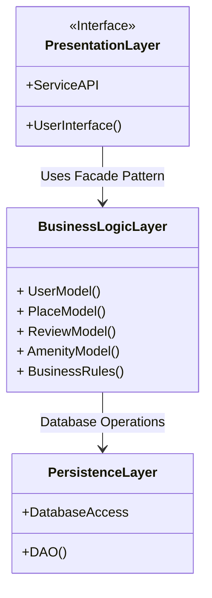
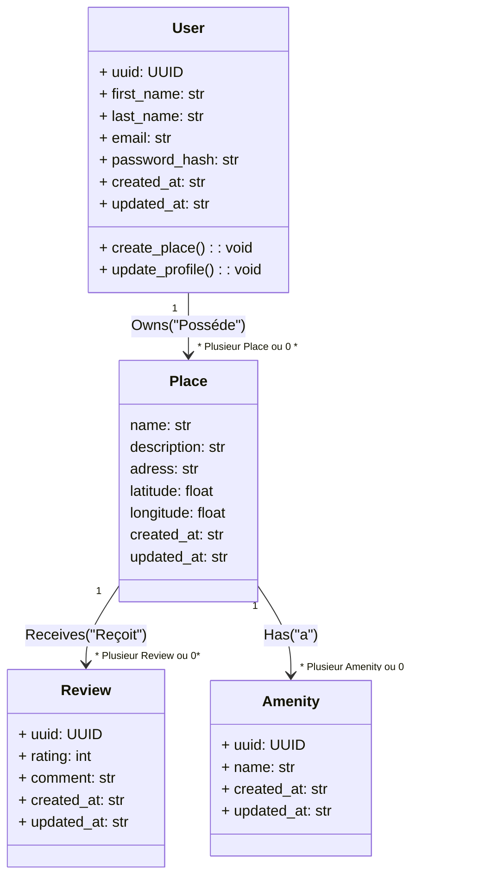
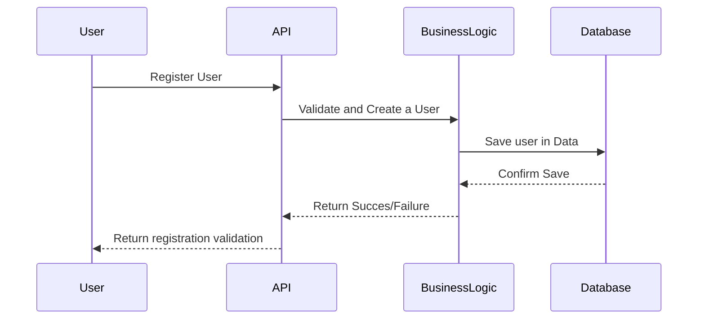
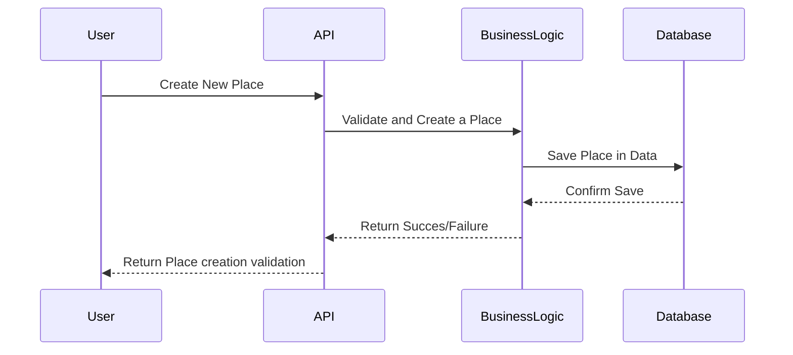
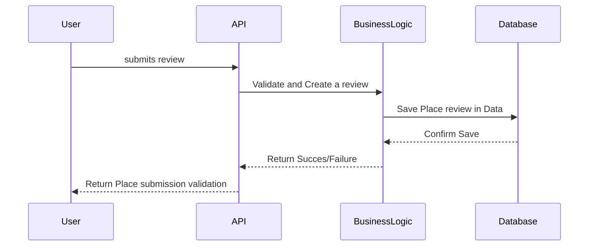
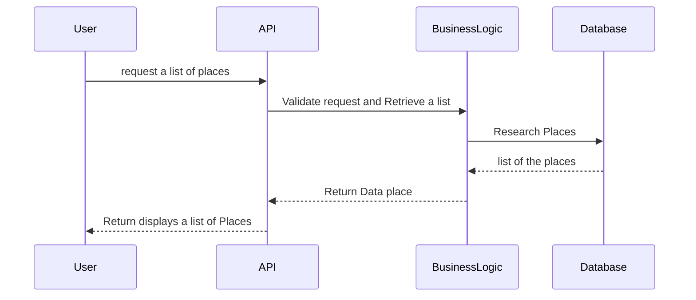

# UML HBNB PART 1

## introduction
This document provides an in-depth overview of the architecture and design of the HBnB project. It consolidates key diagrams, including the system architecture, class structures, and API interaction flows, along with detailed explanatory notes that describe the various components and their interactions. The primary goal of this document is to serve as a clear reference for developers and stakeholders throughout the development phases, ensuring a cohesive and structured approach to building the HBnB application.

### 0. High-Level Package Diagram

This layered architecture for the HBnB project is organized as follows:

### 0.1 PresentationLayer (Interface):

ServiceAPI: Facilitates communication with services.

UserInterface(): Manages the user interface.

### 0.2 BusinessLogicLayer:
* UserModel(): Handles user data.
* PlaceModel(): Manages available listings.
* ReviewModel(): Manages user reviews.
* AmenityModel(): Handles amenities for listings.
* BusinessRules(): Applies business rules.

### 0.3 PersistenceLayer:
* DatabaseAccess: Manages database access.
* DAO(): Facilitates data operations.

### Relationships
PresentationLayer --> BusinessLogicLayer: Uses the Facade Pattern to simplify interactions.
BusinessLogicLayer --> PersistenceLayer: Performs database operations.

# 1. Detailed Class Diagram for Business Logic Layer

The class diagram illustrates the key entities of the HBnB project and their relationships:

* User: Represents users of the platform, containing attributes such as uuid, first_name, last_name, email, and password_hash. Users can create places and update their profiles.

* Place: Represents accommodations listed on the platform. It includes attributes such as name, description, address, latitude, and longitude, along with timestamps for creation and updates.

* Review: Represents user feedback on places, consisting of a uuid, rating, comment, and timestamps for creation and updates.

* Amenity: Represents features associated with places, including a uuid, name, and timestamps for creation and updates.

## Relationships:
* A User can own multiple Places (0 or more).
* A Place can receive multiple Reviews (0 or more).
* A Place can have multiple Amenities (0 or more).

# 2. Sequence Diagrams for API Calls
## User Registration

This sequence diagram outlines the process of user registration in the HBnB project:

* User initiates the registration by sending a request to the API.
* The API forwards the request to the BusinessLogic layer for validation and user creation.
* The BusinessLogic layer interacts with the Database to save the new user’s information.
* The Database confirms the successful save operation back to the BusinessLogic.
* The BusinessLogic then communicates the success or failure of the registration back to the API.
* Finally, the API returns the registration validation result to the User.

This flow demonstrates how the user registration process is handled across different layers of the application, ensuring that user data is validated and stored securely.

## Place Creation

This sequence diagram illustrates the process of creating a new place in the HBnB project:

* The User sends a request to the API to create a new place.
* The API forwards the request to the BusinessLogic layer for validation and place creation.
* The BusinessLogic saves the place information in the Database.
* The Database confirms the successful save to BusinessLogic.
* The BusinessLogic returns the result (success or failure) to the API.
* The API informs the User of the place creation result.

This flow explains how a user can create a new place, going through validation, creation, and storage in the database.

## Review Submission

This sequence diagram outlines the process of submitting a review for a place in the HBnB project:

* The User submits a review to the API.
* The API sends the review data to the BusinessLogic layer for validation and review creation.
* The BusinessLogic saves the review in the Database.
* The Database confirms the successful save to the BusinessLogic.
* The BusinessLogic returns the result (success or failure) to the API.
* The API informs the User of the review submission result.

This flow describes how a review is processed, validated, saved in the database, and then returned to the user with a success or failure status.

## Fetching a List of Places

This sequence diagram explains the process of requesting a list of places in the HBnB project:

* The User requests a list of places through the API.
* The API sends the request to the BusinessLogic layer for validation and retrieval of the list.
* The BusinessLogic queries the Database to search for places.
* The Database returns the list of places to the BusinessLogic.
* The BusinessLogic sends the retrieved data back to the API.
* The API displays the list of places to the User.

This flow outlines how a user request for places is handled, including the retrieval of the data from the database and presenting it back to the user.

# Conclusion
The sequence diagrams presented provide a clear understanding of the key processes and interactions within the HBnB project. From user registration and place creation to review submission and retrieving lists of places, each flow follows a structured path through the API, business logic layer, and database.

These flows demonstrate how user requests are validated, processed, and returned after interacting with the database. The separation of layers ensures a well-organized system, making it easier to maintain and scale. Whether it's registering a new user, submitting a review, or listing places, the architecture emphasizes an efficient and secure data handling process throughout.